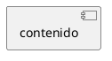

# Building Book - SDD Agent

## Consignas del Agente

1. **Consultar estado frecuentemente**: Antes de cualquier tarea de escritura, ejecutar `bbook plan status` para verificar el estado del proyecto.

2. **No implementar sin aprobación**: Si una actividad tiene `status: pending`, NO escribir código. Alertar al usuario.

3. **Tests primero**: Para cada criterio de aceptación, escribir test antes de implementar código de producción.

4. **Documentación como fuente de verdad**: Implementar solo lo que está en los criterios de aceptación documentados.

5. **Mantener sincronizado**: Después de completar tareas, actualizar frontmatter con el nuevo estado.

6. **Verificar gates**: Antes de trabajar en código, confirmar que el gate de etapa está pasado.

## Proyecto Building Book

Building Book es un **Framework AI Harness SDD** (Specification-Driven Development).

### Estructura del Proyecto

```
docs/
├── Fundation.md          # Especificación general
├── status.yml             # Tracking de progreso
├── diagrams/               # Diagramas SVG
└── plan/
    ├── Plan.md           # Procesos
    ├── business-rules.md # Reglas de negocio
    └── adrs/              # Decisiones de arquitectura

.opencode/
├── agents.md             # Este archivo
└── skills/
    └── building-book/
        └── SKILL.md      # Skill del framework
```

### Estados de Documentos

- `pending`: En revisión, no implementar
- `accepted`: Aprobado, listo para implementar
- `needs-work`: Requiere cambios

### Formato de ID

`<CODE>-<NUM>` donde NUM es secuencial desde 001.

CODE definido en `building-book.yml` → `project.idPrefix`

### Diagramas PlantUML



Renderizado: `plantuml -tsvg <archivo>.puml`

Incrustar: ``

### Comandos

- `bbook build` - Inicializa estructura
- `bbook open` - Inicia servidor web
- `bbook plan status` - Muestra estado actual

## Reglas de Documentación

### Frontmatter

Todo `.md` en `docs/` requiere:

```yaml
---
id: BKB-001
title: Título
version: 0.1.0
status: pending
author: nombre
created: 2026-06-09
updated: 2026-06-09
---
```

### Procesos y Actividades

```
docs/process/<id>/
├── README.md                    # Spec del proceso
├── flowchart.puml               # Diagrama de flujo
├── 4c-code.puml                  # Diagrama de clases
├── diagrams/                    # SVGs del proceso
└── activities/
    └── <id>.md                  # Actividad
```

### Criterios de Aceptación

Cada actividad tiene criterios que definen cuándo está completa.

### Tests

Ubicación: `src/test/java/com/buildingbook/`

Naming: `<ActivityId>Test.java`

## Workflow SDD

1. **Definición**: Especificar requisitos en documentos
2. **Diseño**: Crear diagramas y arquitectura
3. **Implementación**: Código siguiendo criterios de aceptación
4. **Despliegue**: Binarios distribuidos

## Skill

Consultar `.opencode/skills/building-book/SKILL.md` para información detallada del framework.