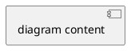

# Building Book - AI Harness SDD Framework

## Overview

Building Book is an **AI Harness for Specification-Driven Development (SDD)**. AI agents build software by following specifications defined in markdown documents, enforced by gates and acceptance criteria.

## Core Principles

1. **Documentation as Source of Truth**: All requirements are defined in markdown documents with frontmatter
2. **Gates**: Quality checkpoints before progressing to implementation
3. **Test-First**: Acceptance criteria define tests before code is written
4. **Status Tracking**: Every document has a status (pending/accepted/needs-work)

## Document Structure

```
docs/
├── Fundation.md          # General specification
├── status.yml             # Progress tracking
├── diagrams/               # PlantUML SVGs
└── plan/
    ├── Plan.md           # Processes
    ├── contract.yml      # CLI, HTTP, WebSocket contracts
    ├── models.yml        # Data models
    ├── business-rules.md # Atomic rules
    └── adrs/              # Architecture decisions

.opencode/
├── agents.md             # Agent instructions
└── skills/
    └── building-book/
        └── SKILL.md      # This file
```

## Frontmatter Schema

```yaml
---
id: <PREFIX>-<SEQ>     # e.g., BKB-001
title: Title
version: 0.1.0
status: pending         # pending | accepted | needs-work
author: name
created: 2026-06-09
updated: 2026-06-09
---
```

## Status Workflow

- `pending`: In review, do not implement
- `accepted`: Approved, ready to implement
- `needs-work`: Requires changes

## Commands

- `bbook build` - Initialize project structure
- `bbook open` - Start web server
- `bbook plan status` - Show current state

## PlantUML Diagrams

Files ending in `.puml` render to `.svg` in `diagrams/` folder.



Embed: ``

## Architecture

Infrastructure → Domain ← Presentation (DI connects layers)

## AI Harness Components

- **StageEnforcer**: Validates gate progression
- **TestFirstEnforcer**: Ensures tests before implementation
- **DocumentationVerifier**: Validates spec completeness
- **StatusTracker**: Maintains status.yml sync
- **OpencodeIntegration**: Connects to opencode agent system