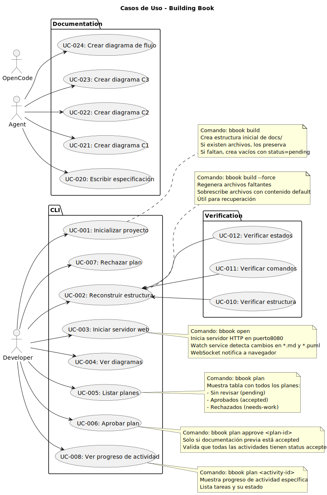

# Building Book - Specification

## 1. Nombre del Proyecto

**Building Book** - SDD Framework Harness

## 2. Descripción

Framework AI harness de desarrollo driven por especificaciones (SDD) que permite a equipos de desarrollo y agentes IA mantener trazabilidad completa entre especificaciones, diagramas y código. Opera como CLI standalone y servidor web local con live reload.

## 3. Objetivos Estratégicos

- Proporcionar un harness que guíe el desarrollo basado en especificaciones
- Generar y mantener estructura de documentación para proyectos
- Renderizar diagramas PlantUML automáticamente (SVG)
- Convertir markdown a HTML dinámicamente para visualización web (commonmark-java)
- Verificar cumplimiento de criterios definidos en `building-book.yml`
- Proporcionar plataforma web para revisar planificación y estado del proyecto
- Integrarse con opencode via `.opencode/` para activar workflow SDD en agentes

## 4. Alcance (DENTRO)

- CLI con comandos `bbook build`, `bbook open`, `bbook plan`
- Servidor HTTP embebido con live reload
- Renderizado de diagramas PlantUML (SVG)
- Rendering de markdown a HTML (commonmark-java)
- Sistema de estados para documentación (`pending`, `accepted`)
- Verificación de estructura de proyecto contra `building-book.yml`
- Integración con opencode via `.opencode/agents.md`
- Frontmatter en documentos para tracking de estado
- Modelo4C (Context, Container, Component, Code) por etapa

## 5. Alcance (FUERA)

- Generación de código desde especificaciones
- Hosting remoto de documentación
- Sistema de autenticación
- Métricas de proyecto avanzadas
- CI/CD integration

## 6. Actores / Usuarios

| Actor | Descripción | Interacción |
|-------|-------------|-------------|
| Desarrollador | Usuario principal | CLI commands, navegador web |
| Agente IA | Agente opencode | Genera documentación, ejecuta CLI |

## 7. Restricciones

- PlantUML JAR se descarga automáticamente si no existe
- Puerto default 8080 para servidor HTTP
- Estructura de directorios fija definida en `building-book.yml`
- Estados: `pending` → `accepted` o `needs-work`
- Arquitectura por capas: Presentación → Dominio ← Infraestructura
- El dominio no conoce implementaciones de infraestructura

## 8. Entregables Principales

| Entregable | Descripción | Etapa |
|------------|-------------|-------|
| `docs/Fundation.md` | Especificación general | Definición |
| `docs/4c-context.puml` | Diagrama C1 (contexto) | Definición |
| `docs/usescase.puml` | Casos de uso | Definición |
| `docs/plan/models.yml` | Modelo de datos | Definición |
| `docs/status.yml` | Tracking de progreso global (sistema) | Definición |
| `docs/plan/Plan.md` | Plan de implementación | Planificación |
| `docs/plan/4c-containers.puml` | Diagrama C2 (contenedores) | Planificación |
| `docs/plan/4c-components/*.puml` | Diagramas C3 (componentes) | Planificación |
| `docs/plan/contract.yml` | Contratos de API/CLI | Planificación |
| `docs/process/` | Procesos y actividades | Implementación |
| CLI binaries | Ejecutables para distribución | Implementación |

## 9. Criterios de Éxito

### 9.1 Definition Stage

- [x] `docs/Fundation.md` con especificación completa
- [x] `docs/4c-context.puml` aprobado
- [x] `docs/usescase.puml` aprobado
- [x] `docs/plan/models.yml` aprobado
- [x] `docs/status.yml` con tracking inicial
- [x] Gate GATE-001 pasado

### 9.2 Planning Stage

- [x] `docs/plan/Plan.md` aprobado
- [x] `docs/plan/4c-containers.puml` aprobado
- [x] `docs/plan/4c-components/*.puml` aprobados
- [x] `docs/plan/contract.yml` aprobado
- [ ] Gate GATE-002 pasado

### 9.3 Implementation Criteria

- [ ] `bbook build` crea estructura sin errores
- [ ] `bbook open` inicia servidor en puerto 8080
- [ ] `bbook plan` muestra estados correctamente
- [ ] Live reload funciona para `.md` y `.puml`
- [ ] Estados se actualizan en frontmatter

## 10. Casos de Uso

## 11. Diagrama de Contexto

## 12. Modelo4C por Etapa

| Etapa | Nivel C4 | Descripción |
|-------|----------|-------------|
| Definición | C1 (Context) | Diagrama de contexto del sistema |
| Planificación | C2 (Container) | Contenedores principales (CLI, Core, Web) |
| Planificación | C3 (Component) | Componentes internos de cada contenedor |
| Implementación | C4 (Code) | Diagramas de clase y flujo por proceso |

## 13. Glossary

| Término | Definición |
|---------|------------|
| Harness SDD | Marco que guía desarrollo basado en especificaciones |
| Building Book | Nombre del proyecto/framework |
| bbook | Alias del CLI |
| SDD | Specification-Driven Development |
| 4C Model | Context, Container, Component, Code |
| PlantUML | Herramienta de diagramas |
| Live Reload | Actualización automática en navegador |
| Gate | Punto de validación para avanzar etapa |

## 14. Referencias

- [Specification-Driven Development (SDD)](https://github.com/github/spec-kit/blob/main/spec-driven.md)
- [C4 Model for Software Architecture](https://c4model.com/)
- PlantUML Language Reference
